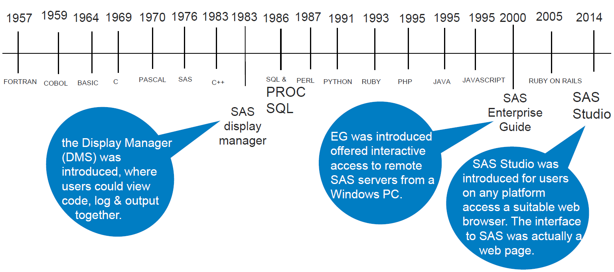

```{r setup, include=FALSE}
knitr::opts_chunk$set(echo = TRUE)

library(tidyverse)
library(kableExtra)
library(DT)
```

# Welcome

*"Even when walking in a party of no more than three, I can always be certain of learning from those I am with."* - Confucius

## Purpose

-   Have a space to share code and learn from/with each other

## Format

-   Flexible

-   Relaxing

-   Wide range of topics

---

# Tentative topics

```{r echo=FALSE}
tribble(
  ~num, ~date, ~topic,
  1, "2022-06-23",   "Ways to code SAS",
  2, "2022-07-07",   "SAS macros (1)",
  3, "2022-07-21",   "SAS macros (2)",
  4, "2022-08-04",   "Proc SQL",
  5, "2022-08-18",   "R",
  6, "2022-09-01",   "ArcGIS"
) %>% 
  kbl() %>%
  kable_material_dark()
  

```
<br/>

Other topics of interest?

  -   Tableau
  -   Convert `character` -> `numeric` and `numeric` -> `character`
  -   Git

---

# How to run SAS 

Three interfaces:

  -   **SAS Windowing Environment** 
      -   classic
      
  -   **SAS Enterprise Guide** 
      -   project based; program history/version control
      
  -   **SAS Studio**
      -   in a web browser

*“DM is the simplest, EG has projects, SS runs in browsers.”*

https://blogs.sas.com/content/sastraining/2017/04/12/whats-your-sas-interface/

Other ways:

  -   **SAS OnDemand for Academics** (online; no installation)
  -   **Jupyter Notebook** (SAS + Python)
  -   **R studio** (package: `SASmarkdown`)

---

# Timeline



ref: http://www.wiilsu.org/sdajgfuirHIUTlsdfnloa312/SUSJun2016/Proceedings/Slides/Shankar%20-%2040%20Years%20of%20SAS%20-%203%20Incredible%20Coding%20Tools.pdf

---

# SAS Windowing Environment - Display Manager (DM)

-   Provides a full programming interface that can be used to write, edit, and submit SAS code
-   Windows for viewing log and output
-   An Explorer window to help you find files
-   A table viewer: view and edit SAS data sets

---

# SAS Studio

-   Runs in a browser (e.g., Google Chrome, MS Edge, Firefox)
-   Snippets
-   Issues
    -   mouse scroll wheel
    -   dependency on web browsers

---

# SAS OnDemand for Academics

-   "SAS® software in the cloud – for free"
-   Good for learning SAS

https://www.sas.com/en_us/software/on-demand-for-academics.html

https://welcome.oda.sas.com/login

---

# SAS Enterprise Guide

-   Project-based
-   Point-and-click
-   Program History (track changes)
  -   Set up: 
    Tools >> Options >> Program History

  -   Changes   Commit    History

---

# Jupyter Notebook

-   Run both SAS and Python programs in the same environment

RUN SAS IN PYTHON WITHOUT INSTALLATION

https://www.listendata.com/2021/01/run-sas-in-python-without-installation.html

---

# SAS in R studio

-   Package: `SASmarkdown` by Doug Hemken
-   https://www.ssc.wisc.edu/~hemken/SASworkshops/Markdown/SASmdpackage.html
-   https://github.com/Hemken/SASmarkdown
-   https://www.r-bloggers.com/2019/09/create-rmarkdown-document-with-sas-code-and-output-sas-engine/
