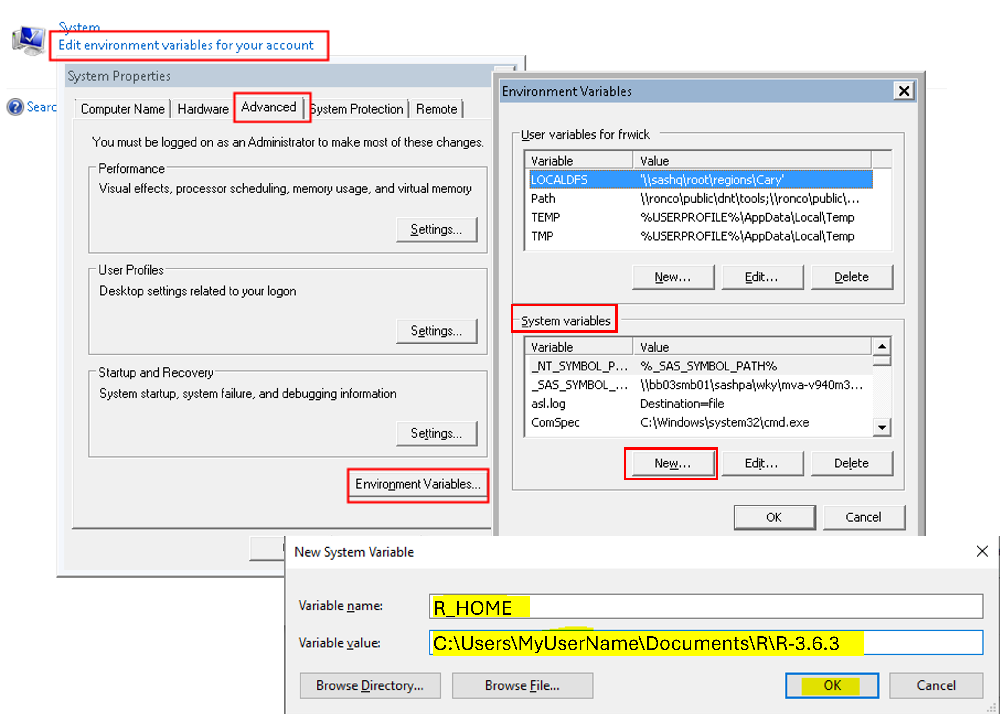
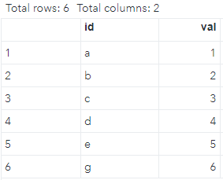
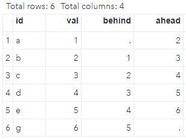

```{r setup, include=FALSE}
knitr::opts_chunk$set(echo = FALSE)

library(tidyverse)
library(httr)
library(jsonlite)
library(kableExtra)

print_kbl <- function(df, title="", f_width=FALSE){
  df |> 
    kbl(caption = title) |> 
    kable_styling(bootstrap_options = c("striped", "hover"), full_width = f_width, position = "left")
}
```

# Introduction

Usually, if a problem can be solved in one programming language, this problem can also be solved in another programming language. However, each programming language has strengths and weaknesses, and each is better at some tasks than others. It is intriguing to combine the strengths of different languages, such as SAS and R. For example, there are many advantages to calling R from SAS according to this [blog](https://blogs.sas.com/content/iml/2013/11/25/twelve-advantages-to-calling-r-from-the-sasiml-language.html). This post summarizes the procedure to set up a PC for running R in SAS.

# Prerequisites

Software:

-   SAS version: 9.4M6
-   SAS IML 15.1
-   R 3.6.3

Operation system: Windows 10

Administrative authority: to install R and set up SAS, you need administrative rights to make changes to your computer. 

# Install R

SAS 9.4 only supports R 3.x.x., and you can find more info about R versions compatible with different versions of SAS [here](https://support.sas.com/kb/67/110.html). You can download a `hot fix` to use the latest version of R (see[ more info](https://blogs.sas.com/content/iml/2013/09/16/what-versions-of-r-are-supported-by-sas.html)). But, in this post, We will use R 3.6.3. and not to worry about a hot fix. 

As an R user, you may want to have the lasted R for your Rstudio, not R 3.6. We can install multiple versions of R and specify which version of R we want to have as the engine for RStudio. But to make R work in SAS, we will install an older version of R so that SAS can "talk" to. You can find old R releases at this [link](https://cran.r-project.org/bin/windows/base/old/).

I installed R 3.6.3, since it is the most up-to-date version that is supported by SAS 9.4M6 without a hot fix.

# Set up SAS

SAS requires two configuration options in order to communicate with R. 

## 'cfg' file

First, the `RLANG` option must be set when SAS is started. This can be done by adding the following two lines in the SAS configuration file `sasv9.cfg`, which is at `C:\Program Files\SASHome\SASFoundation\9.4\sasv9.cfg` on my PC.

```
-config "C:\Program Files\SASHome\SASFoundation\9.4\nls\en\sasv9.cfg"
-RLANG
```

You can use any text editor to open and edit `sasv9.cfg`, but you need administrative rights to save the edited file.

To test if this setup is successful, we can run the following command in SAS:

```
proc options option=rlang;
run;
```

If you get the following statement:

```
NORLANG            Do not support access to R language interfaces
```

then, you still do not have permission to call R from SAS yet, and you need to check the setup of the cfg file.

If you see this statement:

```
RLANG             Enables SAS to execute R language statements.
```

then, great! You have the permission to call R from SAS now! But before you can actually call R in SAS, you need to tell SAS where R is installed on your PC. 

## `R_HOME` environment variable

SAS needs an `R_HOME` environment variable so that it knows where to find the correct, available version of R. In other words, the `R_HOME` environment variable tells SAS where it should go to find R. There are a few [options](https://stackoverflow.com/questions/19525903/editing-sas-config-files-to-execute-r-making-sas-play-well-with-others) to define an environment. One way is to modify the environment variable in Windows directly, by going to `My Computer` -> right click-properties -> `Advanced` -> `Environment Variables`, and setting it there. This also requires administrative rights.

[Here](https://communities.sas.com/t5/SAS-IML-Software-and-Matrix/SAS-IML-Error-An-installed-version-of-R-could-not-be-found/td-p/264645) is a good post about how to define the `R_HOME` environment variable. I borrowed the image from there:

```{r echo=FALSE, out.width = '80%'}

```

One important thing is that you must specify the correct path to the R directory. In my case, since R 3.6.3 is installed in the folder/directory  `C:\Users\MyUserName\Documents\R\R-3.6.3`, I set the 'Variable value' of `R_HOME` as `C:\Users\MyUserName\Documents\R\R-3.6.3`.

After the setting up `cfg` file and `R_HOME`, you may need to restart your computer. 

# Test

Now, we are ready to run some R code in SAS. All communication with R can be done using SAS's `PROC IML`. The basic syntax is like [this](https://www.lexjansen.com/sesug/2018/SESUG2018_Paper-119_Final_PDF.pdf):

```
proc iml;

 submit / R; /* Start submitting statements to R */
 
 (R statements)
 
 endsubmit; /* Stop submitting statements to R */

quit; /* end IML */
```

Basically, we just need to replace `(R statements)` with R code, and then we can have R running in SAS. 

Let us do a simple example. Assume we have a SAS dataset `have` that has two columns: `id` and `val` (values).We can create `have` in SAS as follows:

```
DATA have;
   INPUT id$ val;
   DATALINES;
   a 1
   b 2
   c 3
   d 4
   e 5
   g 6
   ;
run;
```

The dataset `have` looks likes this:

```{r echo=FALSE, out.width = '40%'}

```

Now we want to compute lagged and leading values from column `val`. In R, we can use lag() and lead() functions from `dplyr` package (included in `tidyverse`). So, in SAs we can do something like this to implement the R statements that can get lag and lead values:

```
proc iml;
  call ExportDataSetToR("WORK.have", "dframe" ); /* send dataset from SAS to R */
  submit / R;
  
  	library(tidyverse)
  	dframe_2 <- dframe %>% 
  		mutate(behind = lag(val),
             ahead = lead(val))

  endsubmit;
  call ImportDataSetFromR("WORK.want", "dframe_2"); /* send dataset from R to SAS */
quit;  
```

The above code creates a dataframe `dframe_2` (which has the lag and lead values) in R space and then sends `dframe_2` to SAS space as the dataset `want`, which looks like this:

```{r echo=FALSE, out.width = '40%'}

```

This is a very simple example. We can do much more complicated analytics by combining SAS and R. 

# Summary

The integration of R into SAS represents a convergence of two powerful analytics platforms. By harnessing the strengths of both SAS and R, we can access a more comprehensive toolkit for data analytics and visualization, enabling us to tackle complex analytical tasks with more efficiency and confidence.
