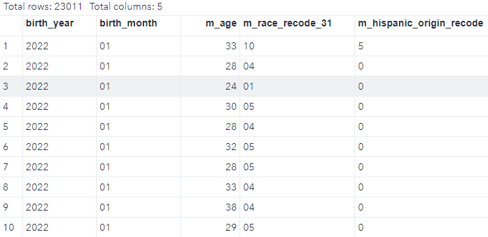

```{r setup, include=FALSE}
knitr::opts_chunk$set(echo = FALSE)

library(tidyverse)
library(kableExtra)

print_kbl <- function(df){
  df %>% 
    kbl() %>% 
    kable_styling(bootstrap_options = c("striped", "hover"), full_width = F)
}
```

# Introduction

A fixed-width data file is a type of structured data format where each column within the file has a specific, predetermined width. In contrast to delimited files like CSV (comma-separated values), where columns are separated by a delimiter character such as a comma or tab, fixed-width files organize data by allocating a fixed number of characters for each column. In this post, we'll explore how to read fixed-width files using SAS, R, and Python.

# About Fixed-Width Files

Fixed-width files, characterized by the allocation of specific widths for each column, offer several advantages and limitations:

-   Store Specific Information in Fixed Columns:

In fixed-width files, data is organized with precision, with each column allocated a predetermined width. This structured approach ensures that specific types of information are consistently stored in their designated columns. For example, in a dataset containing personal information, the first 10 characters might be reserved for the first name, the next 15 for the last name, and so forth.

-   Speed and Low Resource Consumption:

Due to their simple structure, fixed-width files are typically processed more quickly and with lower resource consumption compared to more complex file formats. This efficiency is especially advantageous when working with large datasets or in environments with limited computational resources.

-   Raw Data Without Additional Formatting:

Fixed-width files contain nothing but raw data, devoid of any additional formatting or metadata commonly found in other file formats. This raw nature simplifies the storage and exchange of data but requires careful handling during processing to extract meaningful insights.

-   Lack of Variable/Column/Field Names, Labels, or Tags:

Unlike other data formats such as CSV or Excel, fixed-width files do not inherently include variable names, column labels, or any form of tagging to identify the data within each column. As a result, navigating and interpreting the data can be challenging without prior knowledge of the file's structure. It is thus crucial to understand the variables and columns from the file documentation when working on a fixed-width data file. 


# The Dataset: Vital Statistics Online Data Portal

To illustrate the process of reading fixed-width files, let's use a dataset from the ['Vital Statistics Online Data Portal'](https://www.cdc.gov/nchs/data_access/vitalstatsonline.htm). This dataset contains vital statistics information, such as birth and death records, organized in a fixed-width format. Our task is to extract meaningful insights from this data using SAS, R, and Python. We will use [2022 U.S. Territories Birth Data](https://ftp.cdc.gov/pub/Health_Statistics/NCHS/Datasets/DVS/natality/Nat2022ps.zip), which is a text file about 30 MB after unzipping. If we open the txt file in an text editor, we will see things as following:

```{r echo=FALSE, out.width = '80%'}
knitr::include_graphics("images/nat_2022_public_1.PNG")
```

There are columns of numbers and letters, but no column headers. We need the [documentation](https://ftp.cdc.gov/pub/Health_Statistics/NCHS/Dataset_Documentation/DVS/natality/UserGuide2022.pdf) before we can properly read and use the data. If we go to page 9 of the documentation (a screenshot shown below), we see '202201' actually are for two columns: Birth Year and Birth Month. 

```{r echo=FALSE, out.width = '80%'}
knitr::include_graphics("images/nat_doc.PNG")
```

The documentation is the 'map' that we use to identify each column in the data file. Assume we want to extract the following information from the data: Birth Year, Birth Month, Mother’s Single Years of Age, Mother’s Race Recode 31, Mother’s Hispanic Origin Recode. Then we need to find their positions in the documentation. Let us list them in a table:

```{r echo=FALSE}
tribble(
  ~variable,                        ~position,    ~width,
  'Birth Year', '9-12', 4,
  'Birth Month', '13-14', 2,
  "Mother’s Single Years of Age", '75-76', 2,
  "Mother’s Race Recode 31", '105-106', 2,
  "Mother’s Hispanic Origin Recode", '115', 1
) %>% gt::gt()
```


# SAS

We can use a data step to read in a fixed-width file. One important thing is to specify the positions of columns to read. We can the following code to read the sample data, assuming we put the txt file at 'C:'.

```
data Nat2022; infile 'C:\Nat2022PublicPS.c20230516.r20231002.txt';
input 
   @9  birth_year $4.
   @13  birth_month $2.
   @75  m_age 2.
   @105 m_race_recode_31 $2.
   @115 m_hispanic_origin_recode $1.
   ; 
run;
```

Here is a screenshot of the first 10 rows in the dataset 'Nat2022':

```{r echo=FALSE, out.width = '80%'}

```

# R

Now let us read in the fixed-width file using `read_fwf()` function from the [`readr` package](https://readr.tidyverse.org/reference/read_fwf.html). We will use the start and end positions for each column.


```{r echo=TRUE}
Nat2022_r <- read_fwf(file = "Nat2022PublicPS.c20230516.r20231002.txt", 
                    col_positions =  fwf_positions(
                      start = c(9, 13, 75, 105, 115),
                      end = c(12, 14, 76, 106, 115),
                      col_names = c("birth_year", "birth_month", "m_age", "m_race_recode_31", "m_hispanic_origin_recode")),
                    show_col_types = FALSE)

Nat2022_r %>% head(10)
```

# Python

We can read fixed-width files in Python using the `read_fwf` function in [Pandas](https://pandas.pydata.org/pandas-docs/stable/reference/api/pandas.read_fwf.html). Again, we need to specify the widths of each column in the file, just like we did in SAS or R.One thing to note that the index in Python starts from 0, not 1, and we need to adjust the positions by 1. Also, we can directly read the data using the URL, without downloading the file. 

```
import pandas as pd

colspecs = [(9-1, 12), (13-1, 14), (75-1, 76), (105-1, 106), (115-1, 115)]  # define column widths
cols_names = ["birth_year", "birth_month", "m_age", "m_race_recode_31", "m_hispanic_origin_recode"]

nat2022_py = pd.read_fwf('https://ftp.cdc.gov/pub/Health_Statistics/NCHS/Datasets/DVS/natality/Nat2022ps.zip', 
            encoding = 'utf_8', 
            index_col = False,
            compression='zip',
            colspecs=colspecs, 
            names= cols_names)

nat2022_py.head(10)
```

```{r echo=FALSE, out.width = '80%'}
knitr::include_graphics("images/nat_py.PNG")
```

# Conclusion

In this post, we've explored the reading fixed-width files in SAS, R, and Python using a dataset from the 'Vital Statistics Online Data Portal'. The techniques outlined here can be helpful for processing fixed-width data efficiently. Whether you prefer SAS, R, or Python, one critical thing to handle fixed-width files is to know the file structure and identify the positions of columns in the data.
