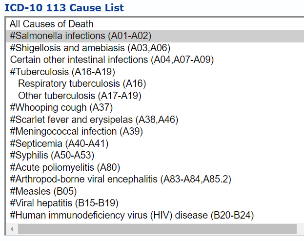

```{r setup, include=FALSE}
knitr::opts_chunk$set(echo = TRUE)

library(tidyverse)
library(rvest)
library(httr)
library(jsonlite)
library(kableExtra)

print_kbl <- function(df, title="", f_width=FALSE){
  df |> 
    kbl(caption = title) |> 
    kable_styling(bootstrap_options = c("striped", "hover"), full_width = f_width, position = "left")
}
```

# Introduction

The International Classification of Diseases, 10th Revision ([ICD-10](https://www.cdc.gov/nchs/icd/icd-10/index.html)) is a globally recognized system for classifying diseases and health conditions. Each ICD-10 code represents a specific disease, making this coding system essential for standardizing mortality statistics. By providing a universal framework for categorizing and tracking causes of death, ICD-10 codes enable health organizations to monitor mortality trends, identify leading causes of death, and analyze patterns across diverse populations.

The National Center for Health Statistics (NCHS) uses ICD-10 codes in its CDC WONDER databases (e.g., [Underlying Cause of Death](https://wonder.cdc.gov/Deaths-by-Underlying-Cause.html)) to organize raw death data into accessible and usable mortality statistics. This process enables users to query and analyze data on causes of death based on geography, age, sex, race, and other demographics. 

In this post, we begin with a brief introduction to` ICD-10 codes`, `the 113 Causes of Death` (with a focus on `rankable causes`), and the relationship between `ICD-10 codes` and these causes. We then explore how to build a crosswalk between `ICD-10 codes` and `rankable causes` using both R and Python. In an upcoming post, we will use this crosswalk to analyze raw mortality data and to obtain the leading causes of death in the U.S.

# Understanding ICD-10 Codes

ICD-10 codes are structured to provide a detailed classification of diseases and health conditions. They follow a standardized format: `LetterNumberNumber.NumberNumber` (e.g., A01.23). 
   
-   The **first character** is always a letter (A-Z) and represents the broad category or chapter of diseases. 
-   The **second and third characters** are digits (0-9) that specify a particular condition within that category. 
-   A **decimal point** follows these initial three characters, separating the main category from additional specificity. 
-   **After the decimal**, up to two more digits (or letters) may be added, providing further details about the condition, such as its severity, location, or other key modifiers. 

For example, the code **J45.9** refers to asthma (represented by "J"), with the digits “45” specifying this respiratory condition, and “.9” indicating unspecified asthma, providing room for further specification if available. Another example, **C34.1**, refers to malignant neoplasm of the lung (signified by “C” for cancers), with “34” pointing to the lung, and “.1” specifically indicating cancer in the upper lobe of the lung. By understanding the elements of ICD-10 codes, users can interpret the structure to identify a condition's broad category, specific diagnosis, and additional defining characteristics.

CDC provides a most detailed list of ICD-10 codes at this [FTP site](https://ftp.cdc.gov/pub/Health_Statistics/NCHS/Publications/ICD10/).

# What are the 113 Causes of Death?

The "113 Causes of Death" is a categorization scheme that NCHS uses for mortality statistics in the CDC WONDER database. This system groups individual ICD-10 codes into 113 overarching categories, making it easier for researchers, policymakers, and public health officials to identify and analyze trends in causes of death without needing to navigate the extensive detail of individual ICD-10 codes. By consolidating thousands of specific codes into broader categories, the 113 Causes scheme helps users see high-level patterns in mortality data, such as the leading causes of death in a given population or year, and track trends over time. For example, individual codes for various types of heart disease are grouped under a single “heart disease” category, while different cancers may be summarized under “malignant neoplasms.” This approach simplifies complex data sets, making the information more accessible for generating insights that can guide public health priorities, allocate resources effectively, and inform policy decisions.

The selection of the "113 Causes of Death" was guided by the need for a balanced categorization that simplifies mortality data while preserving meaningful distinctions between different causes of death. These 113 categories cover a comprehensive range of health conditions that contribute significantly to mortality, including common chronic diseases, infectious diseases, injuries, and other major health events. 

In the 113 Causes of Death list, some are designated as “rankable”. In CDC WONDER's [Underlying Cause of Death database](https://wonder.cdc.gov/Deaths-by-Underlying-Cause.html) (see a screenshot below), a "#" symbol preceding the cause label indicates a "rankable" cause of death. For example, `#Salmonella infections (A01-A02)` is a rankable cause, and `Respiratory tuberculosis (A16)` is unrankable. 

```{r echo=FALSE, out.width = '60%'}

```

These rankable causes are ordered from most to least common cause of death to create the “leading causes of death” listing. Leading cause of death rankings are based on numbers of deaths, not death rates. 

It is worth noting that each cause label includes the corresponding ICD-10 codes. For example, the label **"Salmonella infections (A01-A02)"** encompasses ICD-10 codes **A01** and **A02**. This labeling system helps users easily identify the specific ICD-10 codes grouped within each cause category, making it easier to reference and interpret mortality data accurately. It will also help us create a crosswalk between ICD-10 codes and rankable causes.


# Creating a Crosswalk Between ICD-10 Codes and the Rankable Causes

A crosswalk, or mapping table, between ICD-10 codes and the 113 causes—particularly the rankable causes—is valuable for researchers working with mortality data. This crosswalk serves as a reference tool that links detailed, individual ICD-10 codes with the broader categories used in the 113 Causes of Death framework, helping us analyze mortality data at varying levels of specificity. With a crosswalk, we can aggregate mortality data into these predefined categories, making it easier to identify leading causes of death.

We can create a crosswalk based on the `ICD-10 113 Causes List` from CDC WONDER's [Underlying Cause of Death database](https://wonder.cdc.gov/Deaths-by-Underlying-Cause.html). In general, we can use following steps:

1. **Obtain the ICD-10 113 Causes List via Web Scraping**: Start by accessing the CDC WONDER website, where the 113 Causes of Death list is available. CDC WONDER's [Underlying Cause of Death database](https://wonder.cdc.gov/Deaths-by-Underlying-Cause.html) is a dynamic website, as it requires user consent and the content and structure change based on the user selection. But we are only interested in `ICD-10 113 Causes List` in the HTML file, rather than getting the mortality data. So, we can simply download the html file and then do the scraping. We can save the html as 'Underlying Cause of Death, 2018-2022, Single Race Request Form.html' if we accept the default file name; of course, you are free to name the file however you prefer. Then we can use a web scraping tool or script (e.g., in Python with libraries like `BeautifulSoup` or in R with `rvest``) to extract the 113 Causes list. This automated process ensures that we capture all relevant categories and their associated ICD-10 codes in an efficient, structured format. Of course, if you do not want to do web scraping, one alternative is to look at the html source file, find the section with the cause list, copy and paste the text, and then do some cleaning and processing. 

2. **Extract Rankable Cause Items**: From the scraped data, filter out the rankable causes—those starting with `#` in their labels. 

3. **Separate Cause Names and ICD-10 Codes**: Once the rankable causes are isolated, break down each entry into two parts: the cause name and the associated ICD-10 codes. The cause name provides the label (e.g., "Salmonella infections"), while the ICD-10 codes represent the specific conditions included within that category (e.g., "A01-A02"). 

We can create the crosswalk in eith R or Python. Let us try both. 

## R

CDC WONDER's [Underlying Cause of Death database](https://wonder.cdc.gov/Deaths-by-Underlying-Cause.html) is a dynamic website, as it requires user consent and the content and structure change based on the user selection. But we are only interested in `ICD-10 113 Causes List` in the HTML file, rather than getting the mortality data. So we can simply download the html file and then do the scraping. We can save the html as 'Underlying Cause of Death, 2018-2022, Single Race Request Form.html' if we accept the default file name; of course, you are free to name the file however you prefer. 

Let's load the raw HTML file using the `read_html()` from `rvest` package.

```{r}
wonder <- read_html("data/Underlying Cause of Death, 2018-2022, Single Race Request Form.html")
```

We can then locate the `ICD-10 113 Causes List` section in the HTML using its `xpath` and the tag `<option>`. Each `<option>` corresponds to a cause in the list: the attribute `value` in the `<option>` is the cause ID (e.g., `GR113-001`), and the text of an `<option>` is the cause name (e.g., `#Salmonella infections (A01-A02)`). We extract the cause ID's and cause names and keep them into two dataframes, `cause_id` and `cause`, respectively.

```{r}
cause_id <- wonder %>% 
  html_nodes(xpath='//*[@id="D158.V4"]/div[1]') %>% 
  html_elements('option') %>% 
  html_attr("value") %>% 
  as_tibble() %>% 
  rename(cause_id = value)

cause <- wonder %>% 
  html_nodes(xpath='//*[@id="D158.V4"]/div[1]') %>% 
  html_elements('option') %>% 
  html_text2() %>% 
  as_tibble() %>% 
  rename(cause = value)
```

We then bind the columns of `cause_id` and `cause`, filter to keep only rankable causes, extract ICD-10 codes from cause names, and clean both ICD-10 codes and cause names. 

```{r}
rankable_causes <-  bind_cols(cause_id, cause) %>% 
  # keep only rankable causes
  filter(str_detect(cause, "#")) %>% 
  # extract ICD-10 codes from cause name
  mutate(icd10 = sub(".*\\((.*)\\).*", "\\1", cause)) %>% 
  # clean ICD-10 codes
  mutate(icd10 = str_replace_all(icd10, "\\*", "")) %>% 
  # clean cause names
  mutate(cause = str_extract(cause, "(?<=#).+?(?=\\()")) %>% 
  mutate(icd10 = case_when(
    icd10=="V01-X59,Y85-Y86" ~ "V01-V99,W00-W99,X00-X59,Y85-Y86",
    icd10=="U01-U02,X85-Y09,Y87.1" ~ "U01-U02,X85-X99,Y00-Y09,Y87.1",
    TRUE ~ icd10
  )) %>% 
  separate_rows(icd10, sep = ",")

rankable_causes %>% 
  DT::datatable()
  
```

To streamline processing, we address two special cases in ICD-10 code groups:

-   replace `V01-X59` with `V01-V99,W00-W99,X00-X59`
-   replace `X85-Y09` with `X85-X99,Y00-Y09`

These two adjustments makes it easier to expand a code range (e.g., converting `A07-A09` to `A07,A08,A09`), a step that will be needed when creating the crosswalk. We also split rows when a cause includes multiple ICD-10 code groups separated by a comma. For example, a cause like `#Shigellosis and amebiasis (A03, A06)` is divided into two rows: one for the code `A03` and another for `A06`.

Next, we need to handle cases with code ranges, such as A01-A02 and A16-A19. We can expand these ranges by listing each individual code from start to end, separated by commas, and then split the rows so that each code has its own row. Let's write a function `expand_code_range_r` to expand a code range.

```{r}
expand_code_range_r <- function(text){
  letter <- str_extract_all(text, "[A-Z]+")[[1]][1]
  numbers <- str_extract_all(text, "\\d+")[[1]]
  
  res <- paste0(letter, 
                str_pad(seq(numbers[1], numbers[2]), 2, "left", "0") , 
                collapse = "," )
  
  return(res)
}

```

Now we can create the crosswalk between ICD-10 codes and rankable causes. We get a dataframe `crosswalk_icd10_vs_causes` of 1037 rows.

```{r}
crosswalk_icd10_vs_causes <- bind_rows(
  rankable_causes %>% 
    filter(!str_detect(icd10, "-")),
  
  rankable_causes %>% 
    filter(str_detect(icd10, "-")) %>% 
    mutate(icd10 = icd10 %>% 
             map_chr(expand_code_range_r)) %>% 
    separate_rows(icd10, sep = ",")
) %>% 
  arrange(cause_id, icd10)

crosswalk_icd10_vs_causes %>% 
  DT::datatable()
```


## Python

We can follow a similar process to create the same crosswalk in Python. First, let's load some packages.

```{r include=FALSE}
library(reticulate)
```


```{python}
import pandas as pd
import numpy as np
import re
from bs4 import BeautifulSoup
```

Then, we read in the HTML file and parse its content using `BeautifulSoup`. 

```{python}
# Load the HTML file
with open('data/Underlying Cause of Death, 2018-2022, Single Race Request Form.html', 'r', encoding='latin-1') as file:
    content = file.read()

# Parse the HTML content
soup = BeautifulSoup(content, 'html.parser')
```

`BeautifulSoup` does not support XPath expressions. But we can find the cause list by getting all `option` tags and filtering tags with attribute values prefixed with `GR113`. Then we can get the cause ID's and cause names for rankable causes. 

```{python}
# Find the section where the ICD-10 113 Cause List is located
# The causes are in a list of options in a select dropdown, which have an attribute of value prefixed with 'GR113'
icd_section = soup.find_all('option', value=lambda x: x and 'GR113-' in x, string=re.compile(r'\(.*\)'))  
# icd_section

# soup.find_all('option', value=lambda x: x and 'GR113-' in x, text=re.compile(r'\(.*\)'))[0].get('value') 
cause_id_lst = [item.get('value')  for item in icd_section if item.text.strip().startswith('#')]
cause_id_lst

rankable_causes_lst = [item.text.strip() for item in icd_section if item.text.strip().startswith('#')]
rankable_causes_lst

```

We create a dataframe `rankable_causes_py` that contains the rankable cause ID's and names.

```{python}
rankable_causes_py = pd.DataFrame({'cause_id': cause_id_lst, 'cause': rankable_causes_lst})
rankable_causes_py.head()
```

In dataframe `rankable_causes_py`, we extract ICD-10 codes from the 'cause' column, isolating them from other text or symbols. After extraction, we clean both the ICD-10 codes and the 'cause' column. The code also includes logic for handling two special cases, where certain ICD-10 codes are replaced with more specific combinations to improve accuracy for later processing. For rows that contain multiple ICD-10 code groups separated by ',', we split these into individual code groups to avoid clustering data within single cells. Next, we “explode” the DataFrame, creating a new row for each unique ICD-10 code or code group, so that each row represents a single code or code group independently. The final output is a structured DataFrame, where each row contains a clean, individual ICD-10 code or code group and its corresponding cause of death. 

```{python}
cdc_rankable_causes_lst = (rankable_causes_py
 # Extract ICD-10 codes from the cause string
 .assign(icd10 = lambda df_: df_['cause'].str.extract(r'\(([^)]+)\)$'))
 # Remove '*' from ICD-10 codes
 .assign(icd10 = lambda df_: df_['icd10'].str.replace(r'\*', '', regex=True))
# two special cases with different letters in one string
 .assign(icd10 = lambda df_: np.where(df_['icd10'].str.contains("X85-Y09") , "U01-U02,X85-X99,Y00-Y09,Y87.1", df_['icd10']) )
 .assign(icd10 = lambda df_: np.where(df_['icd10'].str.contains("V01-X59,Y85-Y86") , "V01-V99,W00-W99,X00-X59,Y85-Y86", df_['icd10']) )
 .assign(cause = lambda df_: df_['cause'].str.replace(r'\(([^)]+)\)$|#', '', regex=True))
 # Split ICD-10 codes into a list
 .assign(icd10= lambda df_: df_.icd10.str.split(','))
 # Expand the list of ICD-10 codes
 .explode('icd10') 
 )

cdc_rankable_causes_lst

```

Similarly, let's write a function `expand_code_range` to expand a code range in Python.

```{python}
def expand_code_range(code_str):
    """
    Expands a code range string into a comma-separated list of code strings.

    Args:
        code_str: A string representing a code range, e.g., "a1-a9".

    Returns:
        A comma-separated list of code strings representing the expanded range, e.g., "a01,a02,a03,a04,a05,a06,a07,a08,a09".
    """
    # Extract the letter from the code string.
    letter = re.findall(r'[a-zA-Z]+', code_str)[0]
    # Extract the numbers from the code string and convert them to integers.
    numbers_num = [int(num) for num in re.findall(r'\d+', code_str)]
    # Generate a list of code strings from the range of numbers.
    res = ','.join([letter + str(x).zfill(2) for x in range(numbers_num[0], numbers_num[1] + 1)])
    return res
```

Now, we can create a crosswalk that is the same as the one we did in R. 

```{python}
crosswalk_icd10_vs_causes_py = (pd.concat([
    # rows that do not need to expand
    cdc_rankable_causes_lst
    .loc[lambda df_: ~df_['icd10'].str.contains('-')],

    #  rows taht need to expand
    cdc_rankable_causes_lst
    .loc[lambda df_: df_['icd10'].str.contains('-')]
    .assign(icd10 = lambda df_: np.vectorize(expand_code_range)(df_['icd10']) )
    .assign(icd10= lambda df_: df_.icd10.str.split(','))
    .explode('icd10')
    ])
    .sort_values(['cause_id', 'icd10'])
    .reset_index(drop=True)
)

crosswalk_icd10_vs_causes_py
```

# Summary

In this post, we introduced ICD-10 codes, the 113 Causes of Death (with emphasis on rankable causes), and discussed the relationship between ICD-10 codes and these causes. We demonstrated how to construct a crosswalk between ICD-10 codes and rankable causes using both R and Python. This crosswalk sets the foundation for further analysis, and in an upcoming post, we will use it to analyze publicly available mortality data and identify the leading causes of death in the U.S.
